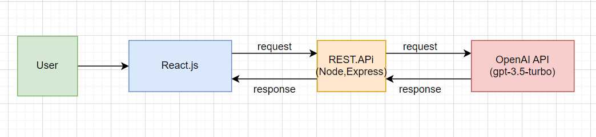

# Youtube link of our project demo
https://youtu.be/6RV8jzLT30s

#Architecture Diagram


# Project Setup Guide


This README provides instructions on how to set up and run the project on your local machine.

## Cloning the Repository

First, clone the repository to your local machine:


## Opening the Project

After cloning, open the folder using Visual Studio Code:

1. Open Visual Studio Code.
2. Go to `File > Open Folder`.
3. Navigate to the cloned repository and open it.

## Running the Backend

To run the backend, follow these steps:

1. Open a terminal in Visual Studio Code.
2. Change directory to the backend folder:

    ```
    cd backend
    ```

   

3. Run the backend server:

    ```
    node index
    ```

## Running the Frontend

To run the frontend, follow these steps:

1. Open a new terminal in Visual Studio Code or use a new tab in the existing terminal.
2. Change directory to the frontend folder:

    ```
    cd frontend
    ```

   

3. Start the frontend application:

    ```
    npm run dev
    ```

## Accessing the Application

After both the backend and frontend are running, you can access the application in your web browser:

- Open your web browser.
- Navigate to `http://localhost:5173/`.

Enjoy using the application!

## Need Help?

If you encounter any issues, please refer to our troubleshooting guide or contact the support team.
